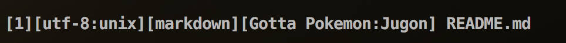
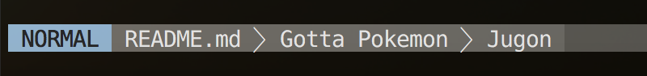

Vim-Pokémon
===========

Pokemon might be in your open file....



Note
----
Inspired by awesome Emacs hacker gongo's [Pokémon-Emacs](https://github.com/gongo/pokemon-emacs/).

Requirements
------------

Vim7.4

Installation
------------

:pizza: Good luck! :pizza:


Usage
-----

Set `pokemon#getdaze()` to your statusline setting.

```viml
set statusline=%<[%n]%m%r%h%w%{'['.(&fenc!=''?&fenc:&enc).':'.&ff.']'}%y%{'[Gotta\ Pokemon\:'.pokemon#getdaze().']'}\ %f%=%{fugitive#statusline()}%l,%c%V\ %P
```


Pokémon is determined uniquely by your open filename (or buffer-name).


If you using [Lightline.vim](https://github.com/itchyny/lightline.vim).

```viml
let g:lightline = {
  \ 'active': {
  \   'left': [
  \     ['mode', 'paste'],
  \     ['pokemon']
  \   ]
  \ },
  \ 'component_visible_condition': {
  \   'readonly': '(&filetype!="help"&& &readonly)',
  \   'modified': '(&filetype!="help"&&(&modified||!&modifiable))',
  \ },
  \ 'component_function': {
  \   'fugitive': 'LightLineFugitive',
  \   'pokemon': 'Pokemon',
  \   'mode': 'LightLineMode'
  \ },
  \ 'separator': { 'left': '', 'right': '' },
  \ 'subseparator': { 'left': '⮁', 'right': '⮃' }

function! Pokemon()
  return pokemon#getdaze()
endfunction
```


License
--------

MIT
